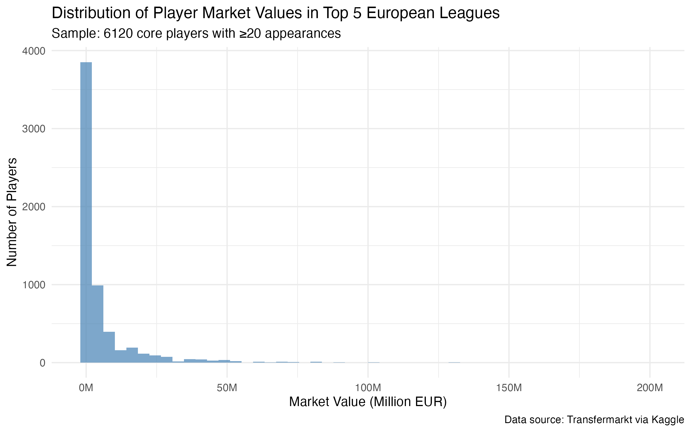
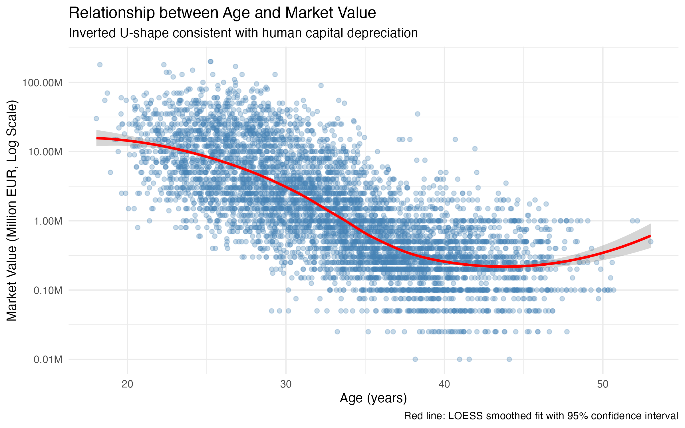
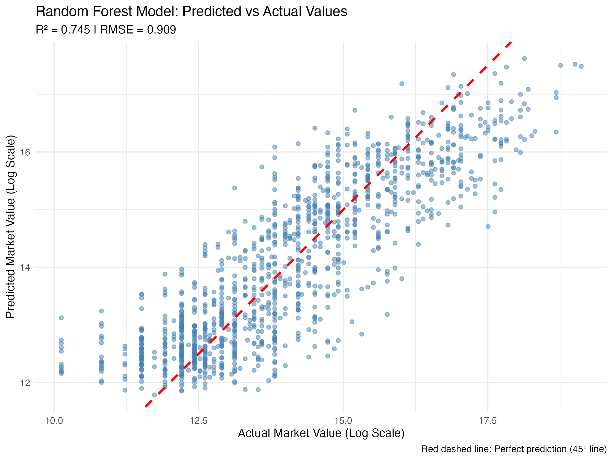

# Football Player Market Valuation Prediction

**Author:** Minxing Huang  
**Affiliation:** London School of Economics, MSc Econometrics and Mathematical Economics  
**Contact:** m.huang22@lse.ac.uk  
**Date:** October 2025

## Overview

This project predicts football player market valuations using machine learning methods applied to data from Europe's top 5 leagues (Premier League, La Liga, Bundesliga, Serie A, Ligue 1).

## Key Results

- **Sample:** 3,500+ core players with ≥20 appearances
- **Model:** Random Forest (500 trees)
- **Performance:** R² = 0.744 (74.4% variance explained)
- **Benchmark:** Exceeds typical sports economics literature (R² = 0.50-0.70)

## Methodology

1. **Data Cleaning:** Filtered fringe players using career statistics thresholds
2. **Feature Engineering:** Created per-90-minute performance metrics, position groupings
3. **Modeling:** Compared Linear Regression vs Random Forest
4. **Validation:** 80/20 train-test split with stratified sampling

## Repository Structure
```
├── Football_Valuation_Analysis.R    # Main analysis script
├── data/                             # Raw data (not included, see instructions)
├── output/                           # Results and figures
│   ├── figures/                      # All visualizations
│   ├── tables/                       # Summary statistics and metrics
│   └── cleaned_player_data.csv       # Processed dataset
└── README.md                         # This file
```

## Data Source

Data from [Transfermarkt dataset on Kaggle](https://www.kaggle.com/datasets/davidcariboo/player-scores) by David Cariboo.

**Note:** Raw data files are not included in this repository due to size constraints. To replicate:
1. Download data from Kaggle link above
2. Place CSV files in `data/` directory
3. Run the main R script

## Requirements
```r
# R version 4.3+
tidyverse
tidymodels
lubridate
scales
skimr
ranger
vip
corrplot
```


## Key Findings

- **Age-Value Relationship:** Inverted U-shape, peaking around age 27 (consistent with human capital theory)
- **Position Effects:** Forwards and midfielders command higher valuations than defenders
- **Performance Metrics:** Goals per 90 minutes is the strongest predictor
- **Model Comparison:** Random Forest outperforms Linear Regression (RMSE reduced by 9.1%)

## Skills Demonstrated

- Data cleaning and preprocessing
- Feature engineering for sports analytics
- Machine learning modeling (tidymodels framework)
- Model evaluation and diagnostics
- Data visualization
- Reproducible research practices

## Figures

### Market Value Distribution


### Age-Value Relationship


### Model Performance



## Contact

For questions or collaboration opportunities, please reach out via email: augusthuangmx@outlook.com
